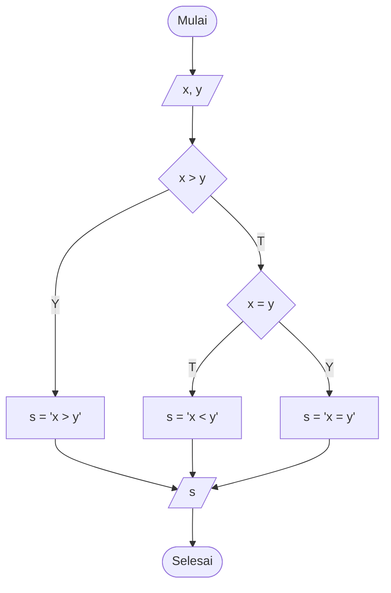

# draw_flowchart_compare_two_numbers

```mermaid
%%mermaid_magic -h 160
flowchart TD
    B([ Mulai ]);
    E([ Selesai ]);
    I[/ x, y /];
    D1{ x > y};
    D2{ x = y};
    S1[ s = 'x > y'];
    S2[ s = 'x < y'];
    S3[ s = 'x = y'];
    O[/ s /];
    B --> I;
    I --> D1;
    D1 -- Y --> S1;
    D1 -- T --> D2;
    D2 -- T --> S2;
    D2 -- Y --> S3;
    S1 --> O;
    S2 --> O;
    S3 --> O;
    O --> E;
```
